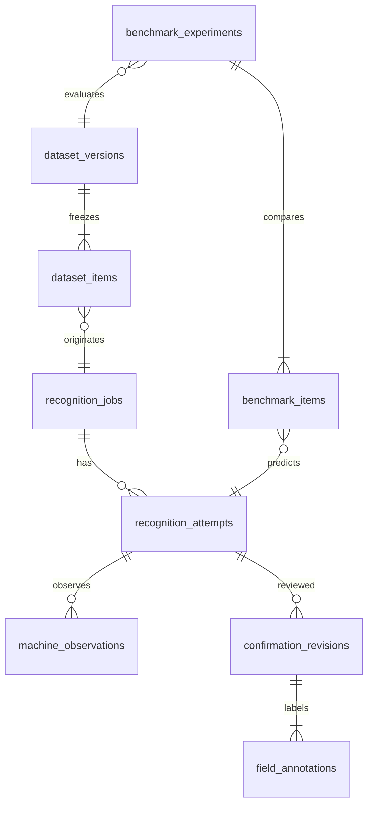

# 架構決策 v0.2

This system is not only an inference application. It is also a dataset generation system. Every confirmed recognition job should improve our ability to evaluate and eventually improve the next generation of the model.

依據規格 1–66；2026-09-24 使用者補充：HTTP、小型內部工具、固定 Port 50003，預留路由器／社區轉發與實體 DDNS。HTTPS 不列為前置條件。

## 分層

Flask routes → application services → provider interface / image preprocessor / rule validator → repositories via SQLAlchemy。模型交換只涉及 Provider registry、adapter 與部署設定。前端不接觸供應商回覆格式、金鑰或網址輸入。

SQLite 保存 durable queue；Worker 獨立程序，一個本地 slot、一個雲端 slot。進行中工作有 lease 與 heartbeat。逾期標記 WORKER_INTERRUPTED，需使用者重試，避免自動重送雲端請求。以程序檔案鎖避免同一資料目錄啟動多個 Worker。Web 使用 Waitress，不使用 Flask 開發除錯伺服器。

## 資料關係

`recognition_attempts` 保存 processed image、normalize、validation、decision、repair、latency、完整設定快照。`machine_observations` 是一對多，目前 stage=VLM，未來能增加 OCR／Decision Model 的各自輸出。未執行 OCR 時 `ocr_raw_result=null`，不將 VLM 文字偽稱 OCR。

Decision v001 只是「選用本次 Provider 結果，所有結果均需人工確認」。記錄選定 observation、模型路徑、自評信心種類；不使用數字門檻、不升級第二個模型。HIGH/LOW threshold 是保留設定，必須配合未來校準分數與 calibration version 才能啟用。

Model、Prompt、Schema、前處理參數／版本、Normalize／Rule／Decision 版本、程式碼雜湊均記錄在 attempt。Ollama 可取得本機模型 digest；雲端未提供版本時保留 null，不假裝可完全重現。

## 人工標註

只有按確認後才建立 Human Ground Truth 版本。每次保留 19 個欄位，含 ai_value、human_value、human_input、before_value、confidence、warning、was_corrected、correction_type、annotation_status、note。人工原因預設 UNKNOWN，絕不依 0/O 差異自動推論 OCR_ERROR。

KNOWN 是有值且人工核實；NOT_PRESENT 是人工確認銘牌未標示；UNREADABLE 是無法辨讀；UNREVIEWED 是尚未核對。只有前兩者可作監督評分。確認整張照片不會把未知欄位變成已知答案。

每次確認為單一交易，使用 expected_revision 防止舊頁面覆蓋新版本。AI payload 不更新；人工再次修改新增 revision 與全欄位 annotations。分享以指定 confirmation ID 建立，畫面有未儲存修改時隱藏分享區。

`was_corrected` 比较標準化值及單位；原始人工輸入另外保存，因此格式變動仍可追查。Dashboard 工作修正率使用每張現場照片最新確認版本，逐欄分母排除 UNREVIEWED。模型重跑、Benchmark 嘗試與多次確認不重複墊高工作數。

## 原圖、前處理與資料集

原圖在唯一目錄以 exclusive create 保存，記錄 SHA-256。EXIF 旋轉、縮圖、HEIC→JPEG、對比及銳化只對衍生圖執行。預設對比及銳化係數 1；JPEG 推論圖不複製 EXIF/GPS。原图不自動清除。

每個 dataset 版本凍結答案、圖檔、觀察、判斷、差異、設定與確認歷程，保存 manifest 和 JSONL 雜湊。類別可重疊，並非互斥生命週期。Hard Example 是模型／流程的難例標記，與人工的影像 EASY/MEDIUM/HARD 難度分開；空值、LOW、警告、修正、同圖模型分歧皆可標記，附原因。

同原圖、同設備群組不跨調整／保留集。自動影像相似去重與設備身分判斷未實作；操作者需對同設備不同照片填同群組。所有匯出 PRIVATE，不自動上傳、訓練或公開。

## API

GET /api/bootstrap；GET/POST /api/jobs；GET/PATCH /api/jobs/:id；POST /api/jobs/:id/attempts；GET/POST /api/jobs/:id/confirmations；GET /api/confirmations/:id/share-text；GET /api/jobs/:id/image；GET /api/attempts/:id/image；GET /api/attempts/:id/debug（開發模式）；GET /api/dashboard；GET/POST /api/datasets；GET /api/datasets/:id/download；GET/POST /api/benchmarks；GET /api/benchmarks/:id；GET /api/benchmarks/:id/compare；POST /api/benchmark-items/:id/assessments。

JSON 錯誤格式為 `{error:{code,message,retryable}}`。未經確認不存在分享資源。所有修改需 CSRF token；所有影像／資料集走受控路由；檔名不取自使用者輸入。外部部署採輕量存取碼與簽章 session。

## 目前邊界

無 OCR、無 Jev 實作、無 cascade、無自動 Model Routing、無 Fine-tuning、無銘牌偵測、無透視校正、無多圖推論。NVIDIA adapter 第一版支援同步 Chat Completions；端點能力須依模型設定。實際設備效能、95% 目標及 LINE 官方帳號收件流程仍需實機與現場資料驗收。
