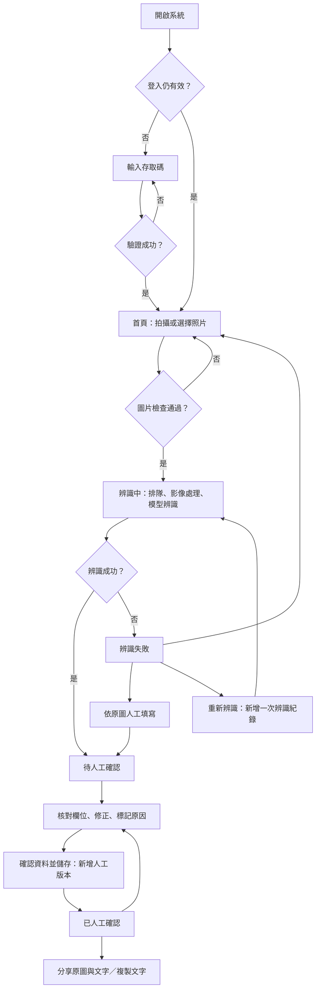
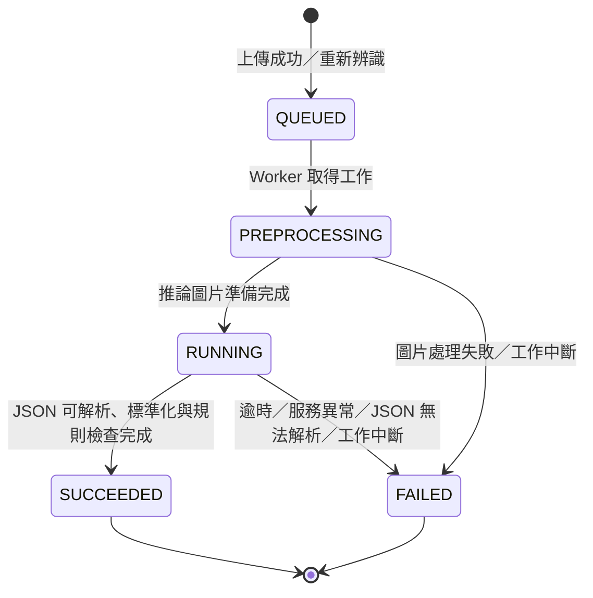
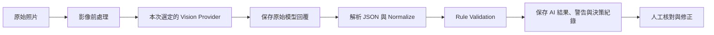
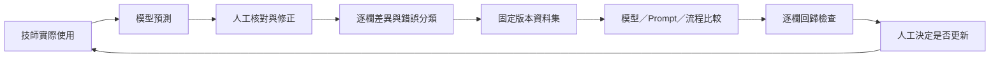

# 陳憲隆自製 大金空調銘牌辨識操作手冊

AI 智慧影像辨識

更新日期：2026-09-28。適用於目前 Flask／SQLite／Ollama／NVIDIA NIM／Google Gemini 版本，服務使用 **HTTP、Port 50003**。目前 NAS 與 Mac 設定均預設使用 Gemini `gemini-flash-latest`，台中 NAS 部署方式見 [部署說明](docs/nas-deployment.md)。

**版本範圍：**NAS 正式版本為 `20260928-gemini-busy-ac563ef`，加入高需求提示與更換模型操作，沿用兩行 LINE 分享及 Gemini 模型選項；使用 `nameplate_identity_v002` 辨識室外機型號、室內機型號、序號，歷史 19 欄完整保留。Mac 已同步預設模型與新金鑰設定，背景服務保持關閉。兩台主機新增的資料不會自動同步。

前次 Gemini 發布時，新金鑰的模型資訊查詢已通過，但 NAS 三次實照推論檢查皆遇到 Gemini HTTP 503 高需求回覆，尚未完成新金鑰的成功實照驗證。本次提示更新沒有追加實際模型呼叫。遇到供應商忙碌，可稍後重試或手動選用仍已設定的 NIM；系統不會自動切換供應商。

這套系統有兩個用途：協助技師把銘牌照片整理成可分享的設備資料，以及保存可用來評估下一代模型的人工標註。**AI 結果是預測；按下人工確認後，才產生人工答案。每次確認都另存版本，不會覆寫 AI 原值。**

本手冊先說明實際操作與狀態，再說明資料飛輪、模型評估及 Mac mini M6 的部署容量。硬體規格與價格查核日為 2026-09-24；容量表是規劃試算，尚非 M6 壓力測試成績。

## 1. 從登入開始理解系統

### 1.1 開啟與登入

手機或電腦開啟管理者提供的完整網址，例如 `http://<主機 IP 或 DDNS>:50003/`。請保留網址的 `http://` 與 `:50003`。

1. 未登入時，系統帶到「登入」頁。
2. 輸入管理者設定的存取碼，登入後看到「拍攝銘牌」與照片選擇操作。
3. 選擇模型、拍照或上傳照片，開始建立辨識工作。
4. 使用完畢可登出；工作資料仍保存在伺服器。

目前採共用存取碼，沒有個別技師帳號與角色權限。系統能記錄修正內容與版本，但不能據此認定是哪一位技師操作。

登入 Session 的有效期限設定為 8 小時；失效後重新登入即可。修改存取碼也會使舊 Session 失效。同一來源 IP 在 15 分鐘內累積 8 次登入失敗，會受到暫時限制；共用對外 IP 的使用者可能共用此限制。

### 1.2 使用者看到的狀態流程



「分享」是把資料交給手機或 LINE，系統不會自動選收件者或按傳送，也沒有「LINE 已送達」的伺服器狀態。

### 1.3 資料庫真正保存的狀態

先分清楚三種資料：

| 名稱 | 代表什麼 | 何時新增 |
| --- | --- | --- |
| Job，辨識工作 | 一張原始照片及其完整歷程 | 每次上傳新照片；Benchmark 執行時另建測試工作 |
| Attempt，辨識嘗試 | 某個模型、某組設定對照片的一次辨識 | 首次辨識、重新辨識、Benchmark |
| Confirmation，人工確認版 | 人工核對後的欄位、差異與原因 | 每次按「確認資料並儲存」 |

Attempt 的狀態機如下；人工確認另存於 Confirmation，不會把 Attempt 的狀態改成 `CONFIRMED`。



| Attempt 狀態 | 手機顯示與含義 | 使用者動作 |
| --- | --- | --- |
| `QUEUED` | 辨識中，正在等待可用模型 | 等候；不要反覆上傳同一張 |
| `PREPROCESSING` | 辨識中，正在處理圖片 | 等候 |
| `RUNNING` | 辨識中，模型正在讀取銘牌 | 等候 |
| `SUCCEEDED`，尚無人工確認 | 待人工確認；流程成功不等於答案正確 | 對照原圖並確認 |
| `FAILED`，尚無人工確認 | 辨識失敗；保留已收到的資料與錯誤原因 | 重辨識、重拍或人工填寫 |
| 有人工確認版 | 已人工確認；這是畫面狀態 | 分享，或修改後再存新版本 |

辨識中採固定 Loading 畫面，更新進度文字，不會持續重建整個頁面。短暫斷線時，畫面會重取狀態；這不是重新呼叫模型。離開頁面也不會取消已建立的工作，可從辨識紀錄重新開啟。

## 2. 技師日常操作

### 2.1 上傳照片

1. 首頁選擇本次使用的模型設定。
2. 按「拍攝銘牌」，或從照片中選擇檔案。
3. 可標記照片難度與設備群組。同一設備的不同照片請使用相同群組，供日後資料集分組。
4. 一般工作使用現場用途；專門做模型測試的照片選「Benchmark 樣本」。
5. 上傳後等待「辨識中」完成。

預設支援 JPEG／JPG、PNG、HEIC，單張最多 20 MB，另有解碼像素上限。伺服器保存原始檔案，另外產生方向校正、縮圖及 JPEG 推論版；HEIC 原圖不會被 JPEG 覆寫。對比與銳利度可設定，目前預設倍率為 1，並非每張都會加強。

拍攝時優先確保型號與序號可讀。避免為取得正面照片而冒險；若原圖已無法辨讀，人工欄位應標記無法辨讀，不用猜答案。

### 2.2 核對與確認

確認操作位於結果頁上方。先對照原圖，再核對本次辨識的全部欄位。新辨識只核對**室外機型號、室內機型號、序號**；照片未印某一項時確認未標示，看不清楚時標記無法辨讀，不用另一個型號或型號規則補猜。

辨識完成後，手機與電腦的照片區都預設展開。照片上方以清楚字體列出有值的欄位；點選某段文字，畫面會跳到下方對應的人工修改欄位並聚焦。修改後，上方預覽同步顯示草稿與未儲存提示；下方原本的核對狀態、AI 原值、原因與儲存版本仍保留。這是便於閱讀的文字摘要，沒有假造文字在原圖中的座標。

結果上方另顯示辨識處理、AI 回應、排隊與總耗時，以及本次輸入／輸出／總 token。總耗時包含排隊與處理，不包含人工校正；token 未回報時顯示「未提供」，不代表 0。這些用量不是帳戶剩餘額度。辨識期間顯示約已等待秒數，不會為計時重新整理頁面。

歷史 19 欄紀錄仍依當時設定顯示下表，原本的六個核心欄位為室外機型號、室內機型號、序號、冷媒、冷媒量、製造年份。切換到新辨識不會刪除舊欄位或改寫舊確認版。

| 歷史欄位群組 | 欄位與標準單位 |
| --- | --- |
| 設備識別 | 製造商、室外機型號、室內機型號、序號 |
| 冷媒 | 冷媒種類、冷媒量 kg |
| 電源 | 電壓 V、頻率 Hz、相數 |
| 能力 | 冷氣能力 kW、暖氣能力 kW |
| 消耗功率 | 冷氣消耗功率 kW、暖氣消耗功率 kW |
| 電流 | 冷氣電流 A、暖氣電流 A、最大電流 A |
| 其他 | 淨重 kg、製造年份、製造月份 |

每個欄位除答案之外，也要正確區分人工核對狀態：

| 人工狀態 | 使用時機 | 能否成為該欄正式評分答案 |
| --- | --- | --- |
| `KNOWN`，已核實 | 照片上有明確可讀的值，已核對 | 可以，評比實際值 |
| `NOT_PRESENT`，未標示 | 已確認銘牌沒有這一項 | 可以，答案應為 null |
| `UNREADABLE`，無法辨讀 | 可能有印，但此照片看不清楚 | 不可以 |
| `UNREVIEWED`，尚未核對 | 還沒確認這一欄 | 不可以 |

空白不等於未標示。例如照片太模糊，看不到序號，不應把它標成 `NOT_PRESENT`。完整標註以該次辨識的欄位範圍為準：新版本需要 3 欄皆可評分，歷史版本需要 19 欄。仍有未核對欄位時可以保存，卻不算該樣本的完整訓練標註。

LOW、UNKNOWN 或規則警告表示需要注意；HIGH 也需要核對。修改時可填修正原因與備註，不確定原因就保留 UNKNOWN。按「確認資料並儲存」後，系統新增人工版本，才開放該版本的分享內容。

若兩人同時編輯同一筆工作，後送出者可能收到版本衝突。請重新載入最新內容後再核對，避免覆蓋他人的確認。系統不會靜默採用最後一人的內容蓋掉前一版。

### 2.3 分享至 LINE

上方分享區會顯示本次分享的是「人工確認第 N 版」。修改已確認內容後，必須再按確認儲存，才會使用新內容分享。

分享文字只保留以下兩行：第一行是人工確認的室外機型號，第二行是序號。標題、欄位名稱、室內機型號及頁尾全部移除，原始相片仍可分享。缺值保留空行，不自行補猜；辨識和人工核對仍維持三欄。

```text
RHF30RVLT
E045859
```

| 手機能力 | 操作方式 |
| --- | --- |
| 支援原生檔案分享 | 等原圖備妥，按「分享原圖與文字」，在手機分享選單選 LINE，再選收件者傳送 |
| 沒有原生檔案分享 | 先儲存原始相片，再按「開啟 LINE 帶入文字」，自行附上剛儲存的原圖 |
| LINE 只帶入相片 | 使用「複製文字」，貼入同一個對話 |
| 自動複製被瀏覽器阻擋 | 展開已選取內容，長按選擇「複製」 |

目前 HTTP 入口若沒有原生分享功能，就使用畫面提供的兩步操作。LINE 文字連結無法自動附加原圖。分享的是原始相片，不是 AI 處理後的縮圖；HEIC 是否能直接預覽或接收，由手機及接收 App 決定。

「複製紀錄連結」只複製這筆工作的網址，沒有把圖片變成公開連結；收件者仍需要能連到本服務並登入。傳完後請在 LINE 確認圖片與文字是否齊全。

### 2.4 紀錄、重辨識與例外狀況

辨識紀錄可重新開啟原圖、不同 Attempt 的 AI 結果及人工版本。重新辨識會新增 Attempt，可選另一個模型；舊結果與修正歷程保留。新 Attempt 必須重新確認，不能沿用舊 Attempt 的分享資格。重新拍照上傳則建立新 Job。

| 畫面／情況 | 意義與處理 |
| --- | --- |
| 圖片格式或大小不符 | 換成支援格式或較小檔案後重傳 |
| 長時間等待模型 | 可能正在排隊；可先看辨識紀錄，管理者確認 Worker 是否運作 |
| 模型逾時／不可用 | 原圖仍保留；可稍後重辨識或人工填寫 |
| 需求量過高，請更換模型 | 供應商明確回報高需求／過載；按「更換模型」跳到重新辨識的模型選單，選擇其他已設定模型後再送出 |
| 模型服務暫時無法使用，請更換模型 | 僅有 HTTP 503 的舊紀錄或一般服務異常，沒有足夠證據判定高需求；同樣可使用「更換模型」操作 |
| NIM 額度不足 | 服務明確回報額度／計費限制，請確認帳戶；可換已設定模型或人工填寫 |
| 暫時受到流量限制 | 一般限流與額度不足不同，稍後重試；不宣稱 token 已用完 |
| `AI_PARSE_FAILED` | 已嘗試一次 JSON 語法修復仍失敗；需重辨識或人工填寫 |
| `WORKER_INTERRUPTED` | 處理程序中斷、租約過期；需手動重新辨識 |
| 登入逾期／401 | 重新登入後開啟該筆紀錄 |
| 操作驗證失效／403 | 重新載入頁面，必要時重新登入 |
| 已在辨識／409 | 已有進行中的 Attempt，不必再送一次 |
| 版本衝突／409 | 有人先儲存了新版本，重新核對後再送出 |
| 登入暫時受限／429 | 停止重複嘗試，確認存取碼並等待限制時間過去 |

「更換模型」只引導使用者選擇，不會自動選模型或送出。重新辨識沿用同一原圖並新增 Attempt；先前失敗紀錄保留。供應商未回報用量時顯示「未提供」，不把失敗當成零 token，也不宣稱免費額度用完；仍可依照片人工填寫後確認。

## 3. 模型如何判別銘牌

NVIDIA 免費存取已取消舊 credits 制度，主要依模型與流量限速；實際帳戶限制請到 NVIDIA 查看。規則來源與系統的用量解讀見 [NIM 免費規則與 token 說明](docs/nim-usage.md)。

### 3.1 現行辨識管線



目前決策版本為 `single_provider_v001`：每次 Attempt 使用一個 Provider。Ollama 在本地執行已設定模型；NVIDIA 與 Gemini Provider 把推論圖片傳至各自雲端 API。目前 NAS 與 Mac 設定以 Google AI Studio／Gemini 為預設，NIM 仍可從模型選單選用；兩種服務使用各自的金鑰。三者共用欄位結構及後端標準化規則，前端不直接使用模型原始回覆。Gemini 會保存實際模型版本、耗時與供應商回報的 token；沒有回報時顯示「未提供」，429 只標示流量限制，不能據此判定免費額度用完。設定與來源見 [README](README.md)。

目前新 Attempt 保存 `nameplate_identity_v002` 與三欄範圍；歷史 Attempt 繼續使用自己的 Prompt、Schema 與欄位快照，原 `nameplate_v001` 不修改。重新辨識會建立目前設定的新 Attempt，不會把舊 19 欄結果轉成三欄。模型輸出上限仍是 4096 tokens；可選的 NVIDIA 思考量設定已加入，但低思考量實照仍有錯字，尚未設為預設；完整銘牌裁切與局部重讀仍屬實驗，未加入正式 UI，見 [速度改善說明](docs/recognition-speed.md)。

原始回覆只要已收到，就先保存，再做解析；因此 JSON 格式錯誤也可以追查模型當時輸出了什麼。無法解析時只做一次有限的語法修復，例如移除 Markdown 外框或尾逗點，不會補猜被截斷的答案。部分欄位缺失時補 null 並產生警告。

### 3.2 一個欄位包含什麼

```json
{
  "outdoor_model": {
    "value": "RHF50RVLT",
    "confidence": "HIGH",
    "raw_text": "MODEL RHF50RVLT",
    "unit": null
  }
}
```

`value` 是模型判讀的值，`raw_text` 是模型聲稱看到的文字，方便人工比對，**不是已驗證的照片證據**。`confidence` 是 HIGH／MEDIUM／LOW／UNKNOWN 的自評；不能把 HIGH 解讀為「正確率 95%」。模型回傳數字 confidence，目前也不會當成校準機率，會歸為 UNKNOWN。

設定中保留的高低信心門檻尚未啟用，不會根據 0.95 或 0.80 自動通過、改派模型或略過人工確認。

### 3.3 標準化與規則各負責什麼

新三欄辨識使用型號與序號規則；下表其他數值與單位規則保留供歷史 19 欄資料使用。

| 項目 | 現行處理 | 不能據此推論 |
| --- | --- | --- |
| 型號 | 去除空白、換行，轉大寫 | 格式正確不表示設備型號存在 |
| 序號 | 保留字符，不互換 0/O、1/I、5/S、8/B；易混字元提示警告 | 不能為了「看起來合理」改序號 |
| 冷媒 | 統一格式，檢查 R22／R32／R410A／R407C 等已知值 | 未列入清單不一定錯；列入也不一定讀對 |
| 電壓 | 轉為數字；50–1000 V 以外提示 | 合理範圍不是大金機型驗證 |
| 頻率、相數 | 頻率通常 50／60 Hz，相數 1／3；其他值提示 | 不會自行替換成最常見值 |
| 量測值與單位 | 有明確依據時轉換，例如 W→kW、g→kg | 無單位或衝突內容不可猜；例如 220/380 不能任取一個 |
| 年、月、正值 | 檢查合理年份、月份 1–12 與數值範圍 | 不能證明銘牌上的數字抄對 |

人工送出時，無法解析的型別或單位會要求修正；合理性警告會保留，仍允許人工確認。這能處理少見設備資料，同時留下當時為何需要注意的紀錄。

### 3.4 現在有做與未來才做的功能

目前有可替換 Provider、影像基本處理、結構化抽取、規則警告、人工確認、多模型 Benchmark 與差異紀錄。

目前尚未執行 OCR 引擎、Jev、OCR＋VLM 衝突判斷、Confidence Gate、Cascade 自動升級、投票決定答案、自動裁切／透視校正、微調或自動部署。相關資料結構預留不等於已啟用功能。

即使多個模型都回答相同內容，也只能說模型一致，不能直接升格成 Ground Truth。Ollama、NVIDIA 與 Gemini 的實際優劣，必須在同一批人工標註照片上比較。

## 4. 人工標註如何形成資料飛輪

### 4.1 保存完整證據鏈

| 資料層 | 保存內容 | 未來可回答的問題 |
| --- | --- | --- |
| Original Input | 原圖、推論版圖片、檔案雜湊、前處理版本 | 照片是否太小？前處理是否影響小字？ |
| Machine Observation | Provider／模型與版本、原始 VLM 回覆；OCR 目前為空 | 模型原本看成什麼？是否拒答或格式錯誤？ |
| Machine Decision | 標準化答案、規則警告、決策紀錄、Prompt 與設定快照 | 錯在抽取、欄位對應、轉換還是流程？ |
| Human Ground Truth | 人工答案、核對狀態、每次修正差異與原因 | 正確答案是什麼？哪些欄位仍無法判定？ |

每次確認依 Attempt 當時的欄位範圍建立標註，新版本 3 筆、歷史版本 19 筆，包含 `ai_value`、`human_value`、`human_input`、`before_value`、AI 信心、警告、`was_corrected`、`correction_type` 與備註。

首次確認的 `before_value` 是 AI 值；再次確認時是前一人工版的值。`was_corrected` 則始終比較「本次人工值／單位」與「這個 Attempt 的 AI 值／單位」，不會因為人工已經改過一次就忘記 AI 原先的錯誤。

### 4.2 一次修正如何成為可用資料

例如原圖印的是 `RHF50RVLT`，AI 回傳 `RHF5ORVLT`：

1. 技師對照原圖，修正室外機型號並確認為 KNOWN。
2. 若無法確定錯誤出在哪個元件，原因標記 UNKNOWN；不要只看到 O/0 就推定 OCR_ERROR。
3. 按確認，保存 AI 原值、人工答案與差異，該照片成為 Hard Example 候選。
4. 管理者把樣本納入有版本的資料集。
5. 工程人員調整 Prompt、模型或規則，用固定資料集重跑比較。
6. 只有新版本在重要欄位沒有退步、速度也能接受，才考慮更新正式設定。

**資料累積不會讓目前的模型自動變強。** 飛輪有效的原因是錯誤可追查、修正可重用、改版能驗證；模型與流程仍需要有意識地調整。



### 4.3 修正原因怎麼選

| 原因 | 適用情況 |
| --- | --- |
| `OCR_ERROR` | 有證據表明 OCR 元件讀字錯誤；現行未啟用獨立 OCR，勿預設選此項 |
| `VLM_EXTRACTION_ERROR` | VLM 擷取值錯誤 |
| `FIELD_MAPPING_ERROR` | 值讀到，但放錯欄，例如冷／暖能力對調 |
| `UNIT_ERROR` | 單位或換算有誤 |
| `FORMAT_ERROR` | 格式問題 |
| `HALLUCINATION` | 答案沒有照片依據；不等同任何讀錯數字 |
| `MISSING_VALUE` | 照片有可讀內容，模型卻漏掉 |
| `WRONG_CANDIDATE` | 多個候選數值中選錯，例如額定與最大值 |
| `IMAGE_UNREADABLE` | 照片本身無法判讀 |
| `UNKNOWN` | 無法判斷根因，保留事實與備註 |

原因由人工標記，可能需要後續複核。它是分析線索，不是系統已證明的因果結論。

### 4.4 Hard Example 與照片難度

系統會因人工修正、LOW、null、規則警告、辨識失敗、可比對的同圖模型結果不一致，或人工判定預測無依據，而標記待改善樣本。模型差異比較要求同原圖雜湊與相同 Normalize 版本，並保留各自結果。

Hard Example 和人工照片難度是兩件事。清楚照片也可能讓模型選錯欄位；正常沒有印室內機型號的銘牌也可能因 null 被標記。不能把 Hard Example 數量直接當成照片不良率。

| 人工照片難度 | 標記參考 |
| --- | --- |
| EASY | 正面、清楚、銘牌比例高 |
| MEDIUM | 小角度斜拍、輕微反光或模糊 |
| HARD | 強烈斜拍、遠距離、小字、髒污、龜裂或遮擋 |
| UNLABELED | 尚未人工分類；不要自動當作 EASY |

### 4.5 建立與匯出資料集

從「資料集」選擇類別、用途與版本名稱，例如 `dataset_v001`，按「建立私有資料集」，完成後可下載私人 ZIP。

| 類別 | 納入條件與用途 |
| --- | --- |
| `confirmed` | 辨識成功、未修正，且該次辨識全部欄位已核實值或確認未標示；新版本 3 欄、歷史版本 19 欄 |
| `corrected` | 已人工確認且有修正，用來分析錯誤 |
| `low_confidence` | 低信心樣本，可尚未確認；沒有人工答案時真值為 null |
| `failed` | 辨識失敗樣本，可尚未確認；適合分析失敗模式 |
| `benchmark` | 已人工確認，至少一個核心欄位可評分；不保證每張都符合本次核心欄位全對率的評分條件 |

每次匯出最多 100 張，相同原圖雜湊去重，選入的候選批次內優先安排 Hard Example。ZIP 保存圖片、觀測、設定快照、人工答案、差異、確認歷程及 manifest／雜湊。版本建立後固定，後續人工改答案不會偷偷修改既有 Benchmark。

用途分成：

- **DEVELOPMENT，調整集**：分析錯誤、嘗試 Prompt 與模型。
- **HOLDOUT，保留驗收集**：保留到候選版本確定後驗收，避免一邊看答案一邊調整。

同一原圖或同設備群組禁止跨兩種用途。這依賴正確標記設備群組；不同拍攝角度的近似照片不會自動被理解為同一設備。反覆依 HOLDOUT 結果調整，也會逐漸失去獨立驗收意義。

每次匯出都有 `training_ready.jsonl`，但只有 DEVELOPMENT 中該樣本全部欄位可評分的資料才會寫入：新版本 3 欄、歷史版本 19 欄；不符合時該檔可以是空的。匯出一併保存欄位範圍，三欄完整不代表完成 19 欄標註。這是未來資料轉換的準備，目前不會自動微調或上傳訓練。所有資料集預設 PRIVATE；含現場背景與設備資訊，對外分享或訓練前須另行確認資料使用權限。

## 5. 如何判斷新模型有沒有比較好

### 5.1 執行固定資料集比較

1. 完成人工標註，建立 `benchmark` 類別的固定版本。
2. 進入「Benchmark」，選擇該版本及伺服器已登記的模型設定，可選 1–8 個不同設定。
3. 等全部工作完成。未完成時的報表是暫時值，不能當成最終成績。
4. 先看逐欄結果與失敗率，再看總分、EASY／MEDIUM／HARD 分層及耗時。
5. 比較舊版與新版時，使用相同資料集與評分版本，檢查報告列出的共同評分欄位及排除欄位。

每次比較記錄資料集版本、模型／模型版本、Prompt、前處理、Normalize、規則與決策設定。改了模型、Prompt、前處理或規則，就應重新跑固定測試。模型名稱相同不代表權重版本相同，應保留可取得的版本或 digest。

### 5.2 各指標真正代表什麼

新三欄版本的核心欄位為室外機型號、室內機型號、序號；歷史完整範圍另含冷媒、冷媒量、製造年份，共六個核心。報表依辨識與人工標註的共同範圍計分並列出排除欄位，不把新版本未要求的其餘 16 欄當成漏讀。型號與序號必須完全相同；`RHF50RVLT` 與 `RHF5ORVLT` 算錯，沒有模糊比對加分。

| 指標 | 現行分母與判定 |
| --- | --- |
| Field Accuracy，各欄已知值正確率 | 成功且值、單位完全相符的筆數 ÷ 該欄 KNOWN 筆數 |
| Core Field Accuracy，核心欄位正確率 | 評分範圍內核心欄正確數總和 ÷ 同範圍核心欄 KNOWN 數總和 |
| Absence Accuracy，正確留空率 | 成功且正確回 null 的欄位數 ÷ NOT_PRESENT 欄位數 |
| Exact Match Accuracy，核心欄位全對率 | 成功且本次所有核心欄全相符的照片數 ÷ 本次核心欄全部可評分的照片數 |
| Benchmark Correction Rate，基準差異率 | 評分範圍內與真值不符的欄位數 ÷ 同範圍 KNOWN＋NOT_PRESENT 欄位數 |
| Null Rate，空值率 | 成功辨識的本次核心欄 null 數 ÷ 成功辨識的本次核心欄總數 |
| Hallucination Rate，幻覺率 | 人工審為 UNSUPPORTED 的非空預測 ÷ 已人工審查的非空預測；未審查時沒有數值 |
| Average Latency，模型平均耗時 | 已記錄的模型呼叫時間平均，包含有耗時的失敗呼叫，不含排隊 |
| Average Processing，平均處理時間 | 前處理開始至辨識結束，含模型、解析與驗證，不含排隊 |

失敗工作仍保留在適用的正確率、全對率與差異率分母，不能只取成功結果美化成績。空值率高也不一定代表錯誤，需搭配 NOT_PRESENT 與漏讀情況判斷。

「95%」必須說清楚是哪個指標及哪些欄位。本 PoC 的核心欄位正確率目標為至少 95%，**不等同每張照片的全部核心欄位正確率達到 95%**。兩者應同時報告，且列出欄位範圍及各欄樣本數；三欄全對率不可直接對比歷史六欄全對率，也不能以軟體測試通過宣稱辨識準確率已達標。

### 5.3 防止重要欄位退步

回歸比較要求同一固定資料集與評分版本，而且兩次全部完成。欄位範圍不同時，兩次都以共同欄位重新計分，報告列出範圍變更與排除欄位；沒有共同核心欄位時不能比較。預設每個共同核心欄位至少有 5 個 KNOWN 樣本，容許下降幅度為 0。若未發現退步或失敗增加，但任一共同核心欄位樣本不足，回報 `INSUFFICIENT_DATA`，不當作通過。

任一核心欄位超過容許退步，或失敗件數增加，優先回報 `REGRESSION`，即使另有欄位樣本不足也是如此。例如室外型號從 98% 升為 99%，但序號從 95% 降為 88%，仍須處理序號退步，不能只用平均分數決定上線。

5 筆是目前程式的最低檢查門檻，不是統計可信度保證。正式驗收需足夠且具代表性的照片，包含 R22／R32、老化、髒污、龜裂、遠距離與小字。系統提供比較結果，由管理者決定是否換模型，不會自動部署。

### 5.4 Dashboard 與日常 KPI

Dashboard 主要看現場工作，依每筆 Job 最新人工確認版統計；Benchmark 工作不混入現場 KPI。

| 項目 | 解讀方式 |
| --- | --- |
| 已確認、完全正確、已修正樣本 | 完全正確需辨識成功、無修正且該次辨識全部欄位皆可評分；新版本 3 欄、歷史版本 19 欄 |
| 工作修正率 | 有任一欄修正的照片 ÷ 已確認照片，和 Benchmark 的欄位差異率不同 |
| 欄位錯誤排行 | 該欄有修正的標註 ÷ 該欄非 UNREVIEWED 標註；此處包括 UNREADABLE，不是正式已知值 Accuracy |
| 依模型／照片難度修正率 | 找出需優先改善的模型或情境 |
| 待改善樣本數 | 看有哪些資料值得分析，不直接當作準確率 |
| 平均人工處理時間 | 前端頁面可見時的核對計時，用來觀察趨勢，不是完整現場工時 |

日常優先觀察「人工修正率是否下降」「核對是否更快」「序號等重要欄位是否退步」。AI 自評信心提高，本身不代表工作品質提高。

## 6. 管理者需要知道的服務運作方式

Web、Worker、模型服務各自負責不同工作。`/healthz` 回應 `{"status":"ok"}` 只代表 Web 能回應，不代表 Worker 正在消化佇列，也不代表 Ollama 模型可推論。

| 元件 | 職責 | 異常時可能看到 |
| --- | --- | --- |
| Web | 登入、上傳、頁面、確認、分享資料 | 連不到系統或請求失敗 |
| Worker | 取佇列、前處理、呼叫 Provider、保存結果 | 工作一直 QUEUED，或中斷工作稍後 FAILED |
| Ollama | 執行本地 VLM | 本地辨識失敗／逾時 |
| Gemini／NVIDIA API | 雲端 VLM | 雲端辨識失敗／逾時，受網路與服務額度影響 |
| SQLite／檔案儲存 | 工作、版本、原圖、資料集 | 儲存或讀取失敗，需要管理者處理 |

原圖、資料庫與資料集需一起納入備份規劃。資料庫請用一致性備份方式，不要只隨意複製正在寫入的單一檔案。NAS 目前使用 `20260928-gemini-busy-ac563ef`，是正式資料來源；Mac 背景服務保持關閉。本次更新沒有資料庫 migration 或依賴變更，既有 15 筆工作、17 次辨識、10 版人工確認、174 筆欄位標註與 14 筆模型觀測均保留；15 張原圖雜湊一致，10 版確認的分享文字已核對為兩行格式。之後的程式更新也應沿用 NAS 資料，不把 Mac 測試資料覆蓋過去；release 切換、備份位置與相容性回復方式見 [NAS 部署文件](docs/nas-deployment.md)。

截至 2026-09-28，外部 DDNS Port 50003 已驗證回應 HTTP 200。使用者回報 DSM 開機任務已設定，但尚未用實際 NAS 重開機驗證自動恢復。

主機睡眠、停電或上游網路中斷，都會影響手機使用。服務是否自動恢復、模型是否需要重新載入，應納入實際部署驗收。佇列會保存，但已執行到一半的工作中斷後不會無限重試。

## 7. Mac mini M6 算力與多人使用評估

### 7.1 先區分已知事實與估算

2026-09-24 查詢目前工作主機：**Apple M2 Pro、16 GiB 記憶體**。因此現有環境不能當成已部署 M6。

專案[驗證紀錄](docs/verification.md)有一次 Qwen3-VL 8B、1200×920 合成英文測試卡的模型呼叫，約 55.0 秒，包含該次載入條件。這不是現場照片平均值、不是多人壓測，也不是 M6 測速。

以下 M6 硬體規格有官方來源；模型容量建議與人數表是工程規劃，必須等實機、指定模型與真實照片壓測後才能訂出服務承諾。

### 7.2 M6 規格與適合的配置

| 項目 | Apple 官方規格 |
| --- | --- |
| CPU／GPU | 12 核心 CPU、12 核心 GPU |
| 統一記憶體 | 16GB／24GB／32GB |
| 記憶體頻寬 | 16GB 配置 153 GB/s；24GB、32GB 配置 170 GB/s |
| SSD | 256GB、512GB、1TB、2TB 選項 |
| 有線網路 | 標配 2.5Gb Ethernet，可選 10Gb |

來源：[Apple 台灣 Mac mini 技術規格](https://www.apple.com/tw/mac-mini/specs/)。CPU 核心數、GPU 核心數或官方 AI 倍數，不能直接換算成「同時幾人辨識」。

Ollama 在 Apple GPU 上使用 Metal 加速；本案不能以神經網路引擎的宣傳算力直接推算 VLM 吞吐量。[Ollama 硬體支援](https://docs.ollama.com/gpu)

本機目前安裝的 `qwen3-vl:8b-instruct`，模型清單標示 Q4_K_M、約 6.14 GB 檔案大小。**磁碟檔案大小不等於推論記憶體用量。** 還需要視覺處理、KV cache、運算緩衝區、macOS 與 Web／圖片處理等空間。

估算記憶體應使用「作業系統與服務＋模型常駐＋視覺輸入／上下文快取＋暫存與餘裕」。圖片解析度、上下文長度、量化、不同模型輪替與同時執行數都會改變需求，不能只用參數量除以二決定夠不夠。

| M6 記憶體 | 本專案規劃定位；需實測確認 |
| --- | --- |
| 16GB | 初期 PoC，優先一個量化 4B／8B 模型、單筆執行；留意記憶體壓力，避免同時跑其他大型程式 |
| 24GB | 新購實際試用的優先起點，給 8B VLM、影像處理及系統較多餘裕 |
| 32GB | 較長期的測試主機選項，適合較多模型比較或較大的上下文；不代表目前程式會自動增加本地並行數 |

以上是配置建議，不是已量測的最低記憶體或效能保證。若 16GB 已出現持續 swap，增加可用記憶體可能比單看 CPU 世代更有價值；若沒有記憶體壓力，更多 RAM 也不保證按比例加速。

### 7.3 「多人連線」有三種不同意思

| 層次 | 目前程式行為 | 容量解讀 |
| --- | --- | --- |
| 登入、看紀錄、人工確認 | Web 與長時間推論分離，Waitress 有 8 個請求處理執行緒 | 8 是同時處理請求的執行緒數，不是只准 8 人登入 |
| 送照片等待辨識 | 工作保存於 SQLite 佇列 | 多人可以送出，但等待時間會隨積壓增加 |
| 真正同時呼叫模型 | **Ollama 最多 1 筆＋雲端最多 1 筆** | 本地模型共用 Ollama 槽；Gemini 與 NVIDIA 共用雲端槽，不能當作兩筆雲端並行 |

一個資料目錄只允許一個 Worker；多啟動 Worker 不會成為擴充方式。只改 Ollama 的並行設定，也不會繞過本系統「本地最多一筆」限制。

Ollama 的並行請求及上下文快取會增加記憶體需求；有足夠記憶體仍需確認吞吐量是否真的提高。未來若要開放多筆本地並行，須同時修改排程策略與驗證模型服務設定。[Ollama 並行與記憶體說明](https://docs.ollama.com/faq)

目前本地與雲端工作可以並行，但不是自動分流。使用者選哪個模型，就排入對應的工作槽；本地忙碌或低信心不會自動送雲端，Gemini 失敗也不會自動切換 NVIDIA。Benchmark 與現場工作共用處理能力，建議大量比較安排在低使用時段。

### 7.4 吞吐量試算：先量每張耗時，再換算人數

令 `S` 為每張圖片平均佔用工作槽的秒數，包含前處理及模型處理，`c` 為本地工作槽數。現行本地 `c = 1`：

```text
理論上限（張／小時）＝3600 × c ÷ S
使用率 ρ＝每小時到件量 × S ÷（3600 × c）
規劃容量可先取理論上限的 70%，保留波動與突發餘裕。
```

70% 是本手冊的起始規劃假設，不是已測得的最佳值，也不能保證尖峰等待時間。

| 假設每張平均耗時 S | 單一本地槽理論上限 | 按 70% 使用率規劃 |
| --- | ---: | ---: |
| 20 秒 | 180 張／小時 | 126 張／小時 |
| 40 秒 | 90 張／小時 | 63 張／小時 |
| 60 秒 | 60 張／小時 | 42 張／小時 |
| 120 秒 | 30 張／小時 | 21 張／小時 |

**這四列是情境，不是 M6 實測結果。** 輸出長度、照片難度、模型冷載入與模型輪替，都可能讓同一硬體的 S 改變。

若假設每張 60 秒、每位技師每小時送 6 張：

| 活躍技師 | 合計需求 | 單一本地槽使用率 | 規劃判斷 |
| --- | ---: | ---: | --- |
| 5 人 | 30 張／小時 | 50% | 可作第一階段試用情境，仍需測尖峰 |
| 10 人 | 60 張／小時 | 100% | 沒有波動餘裕，容易積壓 |
| 20 人 | 120 張／小時 | 200% | 持續到件時佇列會增長，須分流或提升容量 |

依同一假設，42 張／小時約對應 7 位每小時各送 6 張的技師；這是平均工作量換算，不是「最多 7 個帳號」。20 人偶爾看紀錄與 5 人連續送照片，負載可能差很多。

### 7.5 尖峰比平均人數更容易造成等待

假設本地一次一張、每張恰好 60 秒、模型已載入、佇列原本為空，所有照片同時排入，忽略上傳與其他延遲：

| 同時排入照片數 | 第一張完成 | 最後一張完成 | 平均完成時間 |
| --- | ---: | ---: | ---: |
| 1 | 1 分鐘 | 1 分鐘 | 1 分鐘 |
| 5 | 1 分鐘 | 5 分鐘 | 3 分鐘 |
| 10 | 1 分鐘 | 10 分鐘 | 5.5 分鐘 |
| 20 | 1 分鐘 | 20 分鐘 | 10.5 分鐘 |

因此「可開網頁」不等於「每個人都能很快得到辨識結果」。目前沒有使用者配額、現場優先權或佇列長度的業務上限；需以實測到件率、排隊時間與失敗率決定可接受的使用規模。

### 7.6 其他可能先遇到的瓶頸

- **網路**：20 MB 照片經有效 10 Mbps 瓶頸傳輸，理想時間約 16 秒；若 10 人共享同一瓶頸同時傳，合計資料至少約 160 秒才能傳完。這是示例，實際還有協定與重傳成本。主機有 2.5Gb 網卡不代表遠端使用者也有相同速度。
- **磁碟**：假設每件原圖 5 MB、推論圖 1 MB，每日 100 件，一年約 219 GB，還沒算重辨識圖片、資料集 ZIP、備份及模型。256GB 不能全部拿來存照片，512GB 也需要歸檔與外接備份規劃。
- **圖片處理**：壓縮檔案小不代表解碼後小。預設像素上限 6,000 萬像素，RGB 單份像素資料就約 180 MB，處理時還有額外緩衝區。
- **資料庫與下載**：SQLite 適合目前單機流程；多筆同時確認、大批匯出或圖片下載仍會用到 CPU、磁碟與 Web 執行緒。增加網頁執行緒不會提高 VLM 算力。
- **雲端**：Gemini 與 NVIDIA 可分擔本地推論，但受所選模型的圖片限制、API 額度、延遲與網路影響；不是無限容量。

### 7.7 實機驗收與擴充順序

M6 到位後，先用固定現場資料集測 4B／8B 與雲端基準，再逐級測 5、10、20 位模擬使用者。每輪要寫清楚每人多久上傳一張、讀寫比例、模型是否已載入，以及是否同時執行 Benchmark；不要只報連線數。

至少記錄：

| 面向 | 必測內容 |
| --- | --- |
| 品質 | 明確欄位範圍的逐欄 Accuracy、核心全對率、HARD 子集、失敗與回歸；新版本為三個識別欄 |
| 等待 | 上傳、排隊、處理及總時間各自的平均／P50／P95 |
| 網頁 | 登入、看紀錄與確認的反應時間、錯誤率 |
| 資源 | 記憶體壓力、swap、GPU 使用、模型載入、磁碟餘量 |
| 多人一致性 | 同筆修改衝突能提示，無工作遺失、無人工版本互蓋 |

可先以「已約定的到件率下，讀取／確認 API 的 P95 小於 1 秒，辨識總時間 P95 小於 3 分鐘，沒有工作遺失與核心欄位退步」作為待驗證目標。上傳速度另列，不能把不同手機網路混進伺服器反應時間。這些是建議驗收條件，並非目前已達標。

建議擴充順序：先避開尖峰 Benchmark、確認模型與圖片大小是否合適；再評估用雲端承接部分工作。若仍不足，才設計多工作槽、優先佇列或獨立推論主機。新增 OCR、Cascade 或 GPU Server 屬後續階段，需保留相同資料鏈並重新評測。

## 8. 目前市場參考價格與採購建議

以下為 **2026-09-24 查得的台灣新機標價，幣別新台幣**。不扣信用卡回饋、點數或折價券；不含另購螢幕、鍵鼠、外接備份、UPS 與雲端費用。標價可查到不代表現貨可立即交付。

| 配置 | 一般市場參考價 | 查核來源與供貨狀態 |
| --- | ---: | --- |
| Mac mini M6／16GB／256GB | NT$29,900 | [iStore 商品頁](https://ishop.istore.com.tw/products/mac-mini-m6-%E6%99%B6%E7%89%87-16gb-256gb)，查核時售完／貨到通知 |
| Mac mini M6／16GB／512GB | NT$36,900 | [iStore 商品頁](https://ishop.istore.com.tw/products/mac-mini-m6-%E6%99%B6%E7%89%87-16gb-512gb-)；[momo 商品頁](https://www.momoshop.com.tw/product/15638445)標預購 |
| Mac mini M6／24GB／512GB | NT$43,900 | [PChome 商品頁](https://24h.pchome.com.tw/prod/DYAJFD-A900KDKKN)顯示有貨通知；[momo 商品頁](https://www.momoshop.com.tw/product/15638416)預購，頁面預計 2026-10-01 出貨 |
| Mac mini M6／32GB／依需求選 SSD | 待正式報價 | 官方支援 32GB，本次未取得可核實的台灣一般完整售價；向 [Apple](https://www.apple.com/tw/shop/buy-mac/mac-mini) 或經銷商詢價，不按差額自行推算 |
| Mac mini M5 Pro，較高階替代方案 | NT$59,900 起 | [Apple 台灣發布資料](https://www.apple.com/tw/newsroom/2026/08/apple-unveils-a-more-powerful-mac-mini-featuring-the-all-new-m6-and-m5-pro/)，僅作預算級距比較，不能視為本案效能已驗證 |

Apple 公布 M6 一般起價 NT$29,900，教育起價 NT$26,590；M5 Pro 教育起價 NT$56,390。教育價需符合資格，不能直接作為一般公司採購價。[Apple 台灣官方價格來源](https://www.apple.com/tw/newsroom/2026/09/the-new-mac-mini-and-mac-studio-are-available-today/)

就本案新購設備而言，**M6／24GB／512GB、約 NT$43,900 是優先評估起點**：比入門配置有較多記憶體與資料空間。若希望長期做模型比較，取得 M6／32GB 正式報價後，再與較高階設備一起比較。預算只能選 16GB 時，可以先維持單筆本地辨識的 PoC，但要用真實照片確認記憶體壓力與排隊時間。

目前已有 M2 Pro／16GB 可用，若尚未確認它的瓶頸，先取得現場單張耗時、尖峰到件率與記憶體資料，會比僅依晶片世代決定汰換更可靠。外接儲存、備份及 Gemini／NVIDIA API 應另列預算；雲端費用依實際服務方案與使用量取得報價，不預設永久免費。
